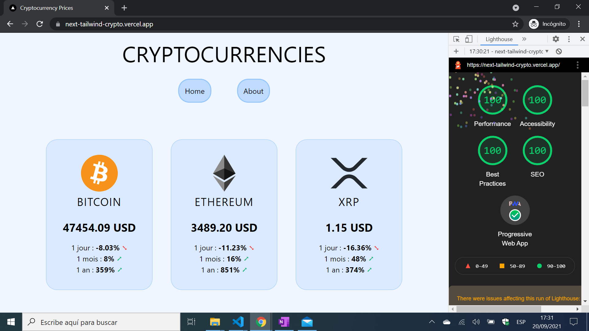

# :zap: Next Tailwind Crypto

* A Next/Tailwind app to display Cryptocurrency info.
* **Note:** to open web links in a new window use: _ctrl+click on link_


## :page_facing_up: Table of contents

* [:zap: Next Tailwind Crypto](#zap-next-tailwind-crypto)
  * [:page_facing_up: Table of contents](#page_facing_up-table-of-contents)
  * [:books: General Info](#books-general-info)
  * [:camera: Screenshots](#camera-screenshots)
  * [:signal_strength: Technologies](#signal_strength-technologies)
  * [:floppy_disk: Setup](#floppy_disk-setup)
  * [:computer: Code Examples](#computer-code-examples)
  * [:clipboard: Status & To-Do List](#clipboard-status--to-do-list)
  * [:clap: Inspiration](#clap-inspiration)
  * [:file_folder: License](#file_folder-license)
  * [:envelope: Contact](#envelope-contact)

## :books: General Info

* Next.js used for frontend is for server-rendered react apps. It has automatic code splitting, simple page-based routing, built-in CSS support and hot reloading. Every component file in the pages folder is treated as a page
* [Tailwind Installation Guide](https://tailwindcss.com/docs/guides/nextjs) used to add Tailwind CSS
* Latest Next/Image optimisation used so image downloaded as Webp format and automatically sized. This is a major advantage over non-optimised Images. Working for datalist page but not used for News API page as all sources have to be added to `next.config.js`

## :camera: Screenshots



## :signal_strength: Technologies

* [React v17](https://reactjs.org/) Javascript library.
* [React icons v4](https://www.npmjs.com/package/react-icons)
* [Next v12](https://nextjs.org/) minimalist framework for rendering react apps on the server.
* [Tailwind CSS v3](https://tailwindcss.com/) utility-first CSS framework
* [PostCSS v8](https://postcss.org/) tool for transforming CSS with JavaScript
* [Nomics Cryptocurrency API v1](https://nomics.com/docs/)
* [Pixabay photos](https://pixabay.com) free to download
* [pngTree](https://pngtree.com/) downloadable images, png etc.
* [pwa-asset-generator v6](https://www.npmjs.com/package/pwa-asset-generator) Automated PWA asset generation and image declaration. Creates icons and JSON array for PWA manifest.json file

## :floppy_disk: Setup

* `npm run dev` runs the app in the development mode. Open [http://localhost:3000](http://localhost:3000) to view it in the browser.
* `npm run build` builds the app for production to the `build` folder. It correctly bundles React in production mode and optimizes the build for the best performance. The build is minified and the filenames include the hashes.
* `npm run start` to run the built app.

## :computer: Code Examples

* tba

```javascript

```

## :clipboard: Status & To-Do List

* Status: Working. Deployed to Vercel as PWA with perfect lighthouse score
* To-Do: Add navbar, footer?, home page grid of cards & change crypto card content, detail page new card - add graph?

## :clap: Inspiration

* [Install Tailwind CSS with Next.js](https://tailwindcss.com/docs/guides/nextjs)
* [Medium: How to use Next.js Image component](https://medium.com/eincode/how-to-use-next-js-image-component-dfbf3725b12)
* [Stackoverflow: Next.JS "Link" vs "router.push()" vs "a" tag](https://stackoverflow.com/questions/65086108/next-js-link-vs-router-push-vs-a-tag)
* [Javascript Info: Async Await explained](https://javascript.info/async-await)
* [Convert your website into a PWA in 8 simple steps](https://milindsoorya.site/blog/convert-your-website-into-a-pwa-in-8-simple-steps-next-js-pwa-series-part-2#step-6-edit-your-_documentjs-file)

## :file_folder: License

* This project is licensed under the terms of the MIT license.

## :envelope: Contact

* Repo created by [ABateman](https://github.com/AndrewJBateman), email: gomezbateman@yahoo.com
